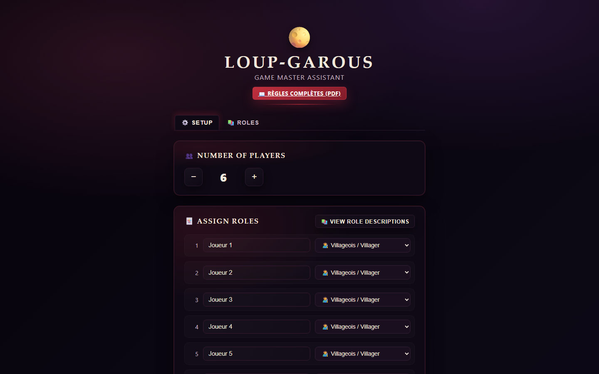
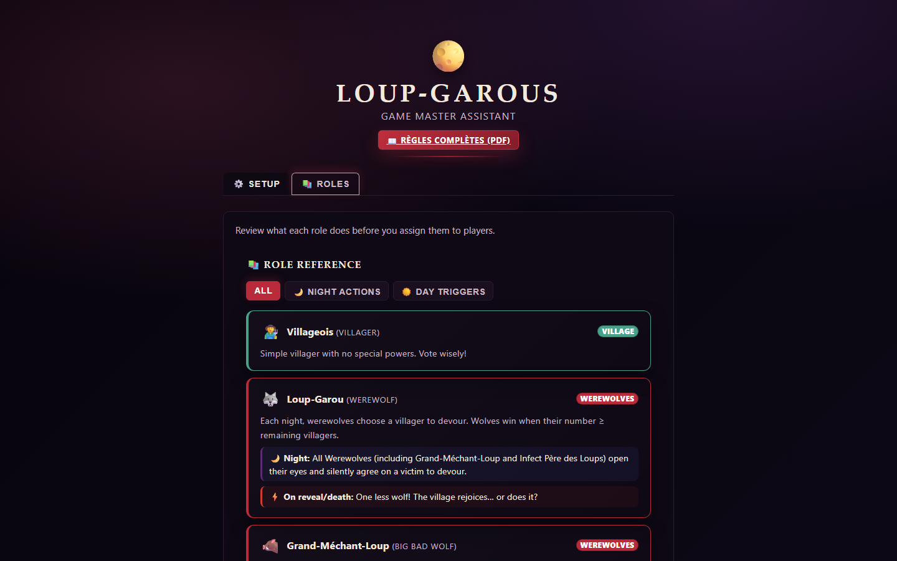
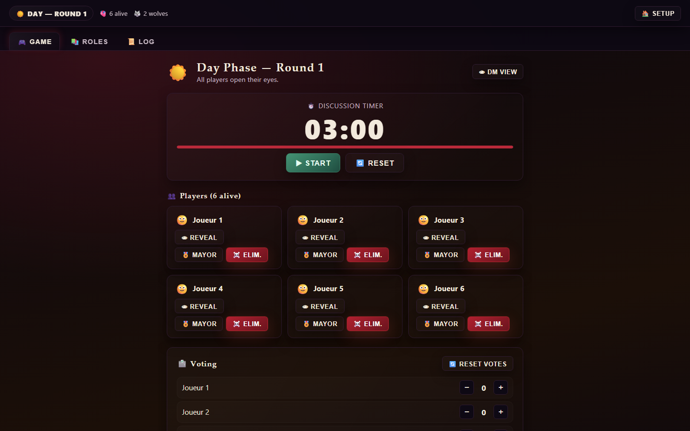
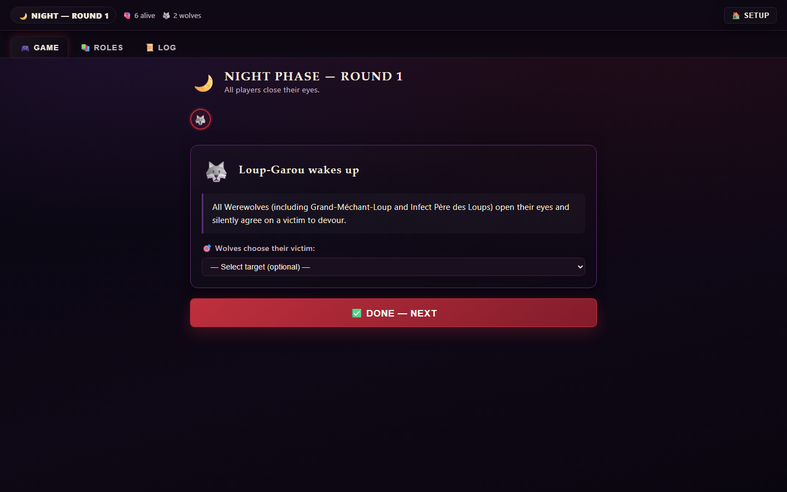

<div align="center">

# Loup-Garous GM Assistant

Web-first moderator tooling for Loup-Garous / Werewolf.

Run role-first setup, ordered seat tracking, night reminders, manual day elimination, and trigger-heavy table flow from one interface, then ship the same product to GitHub Pages and Android through Capacitor.

[](https://github.com/Panacota96/loupgarous/actions/workflows/ci.yml)
[](https://github.com/Panacota96/loupgarous/actions/workflows/deploy-web.yml)
[](https://github.com/Panacota96/loupgarous/actions/workflows/android-qa.yml)
[](https://panacota96.github.io/loupgarous/)
[](https://buymeacoffee.com/santiagogow)

[Live Web App](https://panacota96.github.io/loupgarous/) · [Android Setup](./docs/android-setup.md) · [Web Release](./docs/release/web-release.md) · [Issues](https://github.com/Panacota96/loupgarous/issues)

</div>

## At A Glance

- React + TypeScript app designed for the game master, not for individual players
- Web app is the source of truth for local use, Pages deployment, and Android packaging
- Playwright covers the core moderator flow to catch UI and release regressions
- Built for live table use with role-first setup, seat labels, role reference, timed day phases, and guided night actions

## What This Project Is

`loupgarous` is built around one core idea: the moderator should be able to run the entire table from a single interface without juggling paper notes, remembering every night trigger, or memorizing every player name.

It combines:

- a web app for the actual gameplay flow
- a Playwright suite that exercises the main moderator journey
- a GitHub Pages release track for the live web version
- a Capacitor Android wrapper for mobile distribution

That means the same product flow is designed, tested, and released from one codebase instead of splitting web and Android into separate apps.

## How The Pieces Fit Together

| Layer | Purpose |
| --- | --- |
| React + Vite app | Main product UI and game flow |
| Zustand store | Persistent game state via `localStorage` |
| Playwright E2E | Verifies setup, night/day transitions, and regression-prone flows |
| GitHub Pages | Ships the public web build from `release/web` |
| Capacitor Android | Packages the built web app for Android Studio and Play release work |

## Product Highlights

- Configure 5 to 20 ordered seats by role, without entering player names
- Use `#seat Role` labels everywhere the DM needs to identify someone
- Add, remove, and move seats during setup so the app order matches the physical table
- Choose roles from a limited role pool: unique roles disappear once assigned, and Werewolves are capped at 3
- Run ordered night reminders without target dropdowns for hidden choices the DM should not record
- Track Witch potions with checkboxes instead of player target selection
- Manage power availability for Fox, Witch, Infected Father of Wolves, and Big Bad Wolf from a GM-facing status panel
- Manage day flow with timers, manual elimination, explicit tie-resolution tools, and confirmed win suggestions
- Keep state across reloads with persistent local storage
- Ship the same experience to the web and Android wrapper

Supported setup roles include Villager, Werewolf, Big Bad Wolf, Infected Father of Wolves, Seer, Witch, Hunter, Cupid, Little Girl, Protector, Elder, Bear Tamer, Fox, Two Sisters, Knight with Rusty Sword, Wolf-Dog, Wild Child, White Werewolf, Pied Piper, and Angel. Mayor is tracked as an elected table status, not a setup role. Raven, Village Idiot, and Scapegoat are intentionally hidden from setup and the role reference.

## Current GM Workflow

The default workflow is role-first:

1. Add one ordered role slot for each person at the table.
2. Ask each person for their role and assign it to the matching seat.
3. Reorder seats if needed so `#1`, `#2`, `#3`, and so on match the real table order.
4. Start the game and use seat labels like `#4 Witch` for all day cards, logs, summaries, and reminders.

The app does not ask for player names in the normal setup flow. Existing saved games that still contain names are migrated defensively, but seat identity is the source of truth for current games.

## Night And Power Handling

Night turns are designed as moderator prompts, not as a hidden action database. The app no longer records wolf victims, Cupid lovers, Wild Child role model, Protector target, Infected Father of Wolves target, Big Bad Wolf extra victim, Fox sniff center, Seer target, or Pied Piper targets through dropdowns.

Power status is tracked separately:

- Fox can be marked inactive after losing the sniff power.
- Witch life and death potions are disabled after use.
- Infected Father of Wolves can be marked used after the once-per-game infection.
- Big Bad Wolf can be disabled once the wolf-side death condition locks the extra kill.

Unavailable powers are skipped when night steps are generated. The GM can also override power status during play to correct the table state.

## Screenshot Gallery

These screenshots come from Playwright-driven app states so the README stays aligned with real UI behavior.

<p align="center">
  
  
</p>
<p align="center">
  
  
</p>

## Quick Start

### Run Locally

```bash
npm install
npm run dev
```

Open `http://localhost:5173`.

### Build For Production

```bash
npm run build
```

The production bundle is written to `dist/`.

### Run End-To-End Coverage

```bash
npm run test:e2e
```

The Playwright suite covers the role-first moderator flow, setup constraints, phase transitions, night-step behavior, win confirmation, and UI visibility checks that protect against black-screen regressions.

## Requesting Changes

If you want to request a feature, report a bug, propose a documentation update, or ask for a release-process change, open a GitHub issue:

- [Open an issue](https://github.com/Panacota96/loupgarous/issues)
- Shared and cross-platform work can use the templates in [`.github/ISSUE_TEMPLATE`](./.github/ISSUE_TEMPLATE)
- Web-only and mobile-only release work already has dedicated issue templates

For collaboration standards and security handling, see [CODE_OF_CONDUCT.md](./CODE_OF_CONDUCT.md) and [SECURITY.md](./SECURITY.md).

## Web Release Flow

Local builds default to `/`, which keeps development, static previews, and Android packaging simple.

For GitHub Pages, the production base path is injected by the web release workflow through `VITE_PUBLIC_BASE_PATH`. Without a custom domain, the published URL is:

`https://panacota96.github.io/loupgarous/`

The release flow is:

1. Merge into `release/web`
2. Run [`.github/workflows/deploy-web.yml`](./.github/workflows/deploy-web.yml)
3. Build and publish the Pages artifact
4. Run a live Playwright smoke test against the deployed site

Detailed release and rollback guidance lives in [`docs/release/web-release.md`](./docs/release/web-release.md) and [`docs/release/runbooks.md`](./docs/release/runbooks.md).

## Android Workflow

The repository already includes the Android Studio project in `android/`. The Android app is not a separate implementation; it wraps the built web app.

### First-Time Setup

```bash
npm install
npm run cap:sync
```

`npm run cap:sync` builds the web app into `dist/` and copies those assets into the Capacitor Android project.

### Open In Android Studio

1. Open the `android/` folder in Android Studio.
2. Let Gradle sync complete.
3. Configure the Android SDK path if Android Studio requests it.
4. Select an emulator or device and run the app.

### After Web Changes

Whenever the React app changes:

```bash
npm run cap:sync
```

The Android shell always loads the latest built assets from `dist/`; it does not use the Vite development server.

More detail is documented in [`docs/android-setup.md`](./docs/android-setup.md) and [`docs/release/android-release.md`](./docs/release/android-release.md).

## Gameplay Flow

```text
Role setup -> Night -> Day -> Night -> ... -> Win suggestion -> GM confirmation
```

### Night Order

Night steps are generated from the roles currently in play and their power status. The active flow can include:

1. First-night identity or choice roles such as Cupid, Wolf-Dog, Wild Child, and Two Sisters
2. Passive reminders such as Bear Tamer, Elder, Hunter, and Angel
3. Wolf-side wake-up and special wolf-side reminders
4. Fox, Seer, Witch, Protector, Pied Piper, and other active night roles when their powers are available
5. Night resolution summary using seat labels

### Day Order

1. Review night results and role reminders
2. Run the discussion timer
3. Apply manual elimination by seat
4. Resolve tie handling and reveal/death triggers
5. Review any suggested winner before confirming the game is over
6. Transition back to night when the table keeps playing

Win detection is intentionally advisory. If the app thinks Werewolves, Villagers, White Werewolf, Pied Piper, or Angel have won, it asks the GM to confirm before showing the final victory screen.

## Release Tracks And Ops

- `main`: shared integration branch
- `release/web`: protected branch for GitHub Pages deployments
- `release/mobile`: protected branch for Android QA and Google Play release work

Operational references:

- [`docs/release/branching-model.md`](./docs/release/branching-model.md)
- [`docs/release/web-release.md`](./docs/release/web-release.md)
- [`docs/release/android-release.md`](./docs/release/android-release.md)
- [`docs/release/runbooks.md`](./docs/release/runbooks.md)

If you are shipping mobile, the deeper checklists and rehearsal notes are in [`docs/release/android-qa-checklist.md`](./docs/release/android-qa-checklist.md), [`docs/release/google-play-launch-checklist.md`](./docs/release/google-play-launch-checklist.md), [`docs/release/google-play-internal-readiness-2026-04-07.md`](./docs/release/google-play-internal-readiness-2026-04-07.md), and [`docs/release/release-rehearsal-2026-04-07.md`](./docs/release/release-rehearsal-2026-04-07.md).

## Tech Stack

- React 19
- TypeScript
- Vite
- Zustand
- Playwright
- Capacitor Android

## Security And Community

- Change requests and normal bug reports should go through [GitHub Issues](https://github.com/Panacota96/loupgarous/issues)
- Collaboration expectations are documented in [CODE_OF_CONDUCT.md](./CODE_OF_CONDUCT.md)
- Security vulnerabilities should be reported privately as described in [SECURITY.md](./SECURITY.md)

## License

This project is licensed under the Apache License 2.0. See [LICENSE](./LICENSE).

## Project Structure

```text
src/
  components/   Setup, role reference, game board, phases, timer, tie resolution
  data/         Role definitions and action metadata
  store/        Zustand game state and persistence
  styles/       Component styling
  types/        Shared TypeScript interfaces
public/
  manifest.json
android/
  Capacitor Android Studio project
tests/e2e/
  Playwright end-to-end coverage
docs/
  setup, release, and runbook documentation
```
