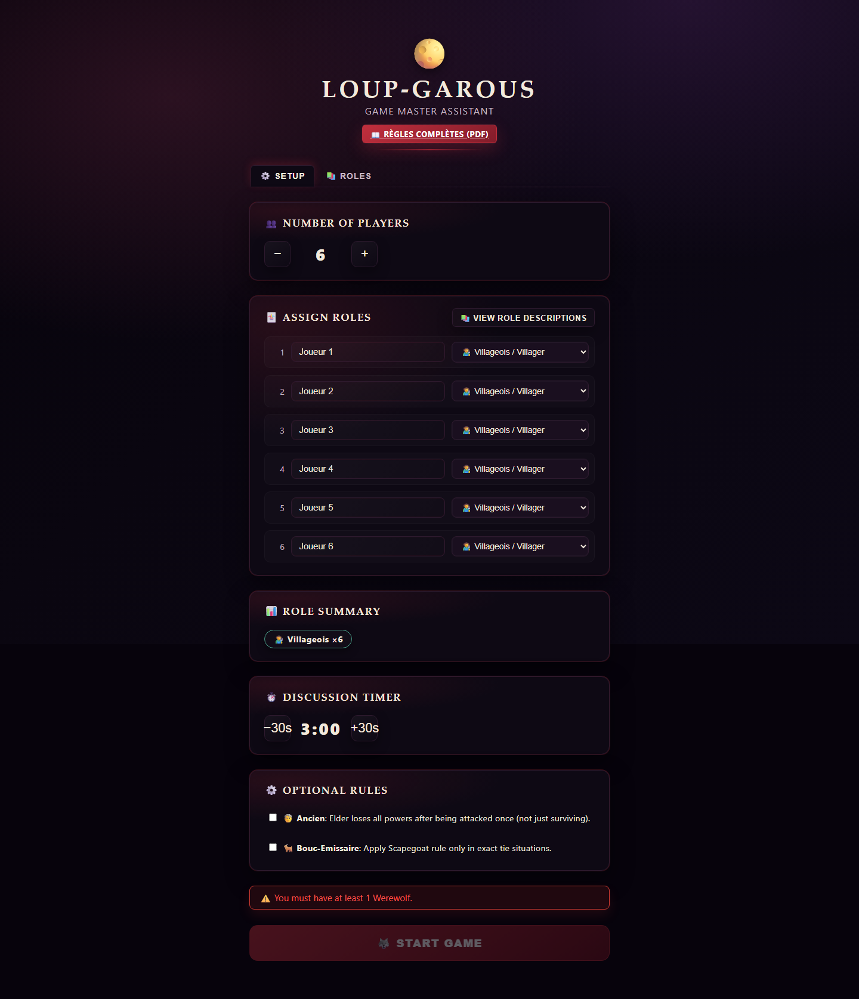
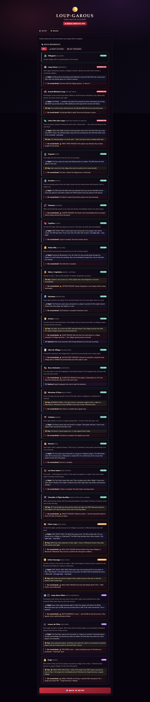
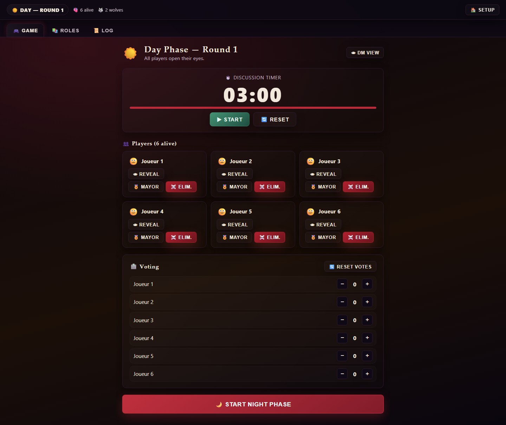
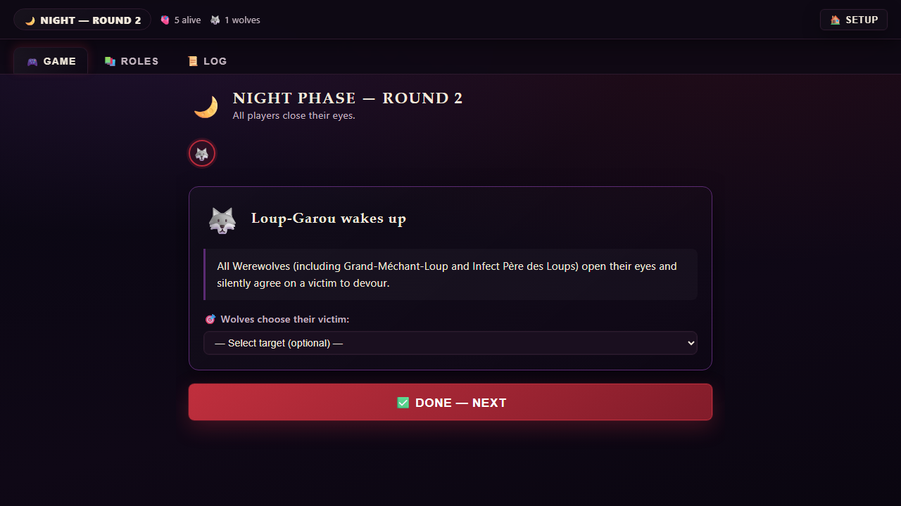

<div align="center">

# Loup-Garous GM Assistant

Web-first moderator tooling for Loup-Garous / Werewolf.

Run setup, role assignment, night actions, day voting, and trigger-heavy table flow from one interface, then ship the same product to GitHub Pages and Android through Capacitor.

[](https://github.com/Panacota96/loupgarous/actions/workflows/ci.yml)
[](https://github.com/Panacota96/loupgarous/actions/workflows/deploy-web.yml)
[](https://github.com/Panacota96/loupgarous/actions/workflows/android-qa.yml)
[](https://panacota96.github.io/loupgarous/)

[Live Web App](https://panacota96.github.io/loupgarous/) · [Android Setup](./docs/android-setup.md) · [Web Release](./docs/release/web-release.md) · [Issues](https://github.com/Panacota96/loupgarous/issues) · [Buy Me a Coffee](https://buymeacoffee.com/santiagogow)

</div>

## At A Glance

- React + TypeScript app designed for the game master, not for individual players
- Web app is the source of truth for local use, Pages deployment, and Android packaging
- Playwright covers the core moderator flow to catch UI and release regressions
- Built for live table use with setup, role reference, timed day phases, and guided night actions

## What This Project Is

`loupgarous` is built around one core idea: the moderator should be able to run the entire table from a single interface without juggling paper notes, remembering every night trigger, or manually tracking exceptions.

It combines:

- a web app for the actual gameplay flow
- a Playwright suite that exercises the main moderator journey
- a GitHub Pages release track for the live web version
- a Capacitor Android wrapper for mobile distribution

That means the same product flow is designed, tested, and released from one codebase instead of splitting web and Android into separate apps.

## How The Pieces Fit Together

| Layer | Purpose |
| --- | --- |
| React + Vite app | Main product UI and game flow |
| Zustand store | Persistent game state via `localStorage` |
| Playwright E2E | Verifies setup, night/day transitions, and regression-prone flows |
| GitHub Pages | Ships the public web build from `release/web` |
| Capacitor Android | Packages the built web app for Android Studio and Play release work |

## Product Highlights

- Configure 5 to 20 players with names and role assignments
- Run ordered night actions with DM guidance for each role
- Manage day flow with timers, vote counting, tie-breakers, and elimination actions
- Track one-time abilities, first-night-only behavior, and reveal/death triggers
- Use a built-in role reference while preparing the table
- Keep state across reloads with persistent local storage
- Ship the same experience to the web and Android wrapper

Supported role coverage includes villagers, werewolves, Seer, Witch, Hunter, Cupid, Little Girl, Mayor, Protector, Elder, Village Idiot, Scapegoat, Bear Tamer, Raven, Fox, and additional advanced roles already represented in the UI.

## Screenshot Gallery

These screenshots come from Playwright-driven app states so the README stays aligned with real UI behavior.

| Setup | Role reference |
| --- | --- |
|  |  |

| Day phase | Night phase |
| --- | --- |
|  |  |

## Quick Start

### Run Locally

```bash
npm install
npm run dev
```

Open `http://localhost:5173`.

### Build For Production

```bash
npm run build
```

The production bundle is written to `dist/`.

### Run End-To-End Coverage

```bash
npm run test:e2e
```

The Playwright suite covers the main 6-player moderator flow, including setup, phase transitions, and UI visibility checks that protect against black-screen regressions.

## Requesting Changes

If you want to request a feature, report a bug, propose a documentation update, or ask for a release-process change, open a GitHub issue:

- [Open an issue](https://github.com/Panacota96/loupgarous/issues)
- Shared and cross-platform work can use the templates in [`.github/ISSUE_TEMPLATE`](./.github/ISSUE_TEMPLATE)
- Web-only and mobile-only release work already has dedicated issue templates

For collaboration standards and security handling, see [CODE_OF_CONDUCT.md](./CODE_OF_CONDUCT.md) and [SECURITY.md](./SECURITY.md).

## Web Release Flow

Local builds default to `/`, which keeps development, static previews, and Android packaging simple.

For GitHub Pages, the production base path is injected by the web release workflow through `VITE_PUBLIC_BASE_PATH`. Without a custom domain, the published URL is:

`https://panacota96.github.io/loupgarous/`

The release flow is:

1. Merge into `release/web`
2. Run [`.github/workflows/deploy-web.yml`](./.github/workflows/deploy-web.yml)
3. Build and publish the Pages artifact
4. Run a live Playwright smoke test against the deployed site

Detailed release and rollback guidance lives in [`docs/release/web-release.md`](./docs/release/web-release.md) and [`docs/release/runbooks.md`](./docs/release/runbooks.md).

## Android Workflow

The repository already includes the Android Studio project in `android/`. The Android app is not a separate implementation; it wraps the built web app.

### First-Time Setup

```bash
npm install
npm run cap:sync
```

`npm run cap:sync` builds the web app into `dist/` and copies those assets into the Capacitor Android project.

### Open In Android Studio

1. Open the `android/` folder in Android Studio.
2. Let Gradle sync complete.
3. Configure the Android SDK path if Android Studio requests it.
4. Select an emulator or device and run the app.

### After Web Changes

Whenever the React app changes:

```bash
npm run cap:sync
```

The Android shell always loads the latest built assets from `dist/`; it does not use the Vite development server.

More detail is documented in [`docs/android-setup.md`](./docs/android-setup.md) and [`docs/release/android-release.md`](./docs/release/android-release.md).

## Gameplay Flow

```text
Setup -> Night -> Day -> Night -> ... -> Win detection
```

### Night Order

1. Cupid on the first night
2. Little Girl passive peek
3. Protector
4. Werewolves choose a victim
5. Fox sniff
6. Seer reveal
7. Witch save or poison
8. Raven curse for the next day

### Day Order

1. Bear Tamer signal
2. Resolve night deaths and triggers
3. Discussion timer
4. Voting with mayor and raven modifiers
5. Execution or tie-breaker resolution
6. Transition back to night

## Release Tracks And Ops

- `main`: shared integration branch
- `release/web`: protected branch for GitHub Pages deployments
- `release/mobile`: protected branch for Android QA and Google Play release work

Operational references:

- [`docs/release/branching-model.md`](./docs/release/branching-model.md)
- [`docs/release/web-release.md`](./docs/release/web-release.md)
- [`docs/release/android-release.md`](./docs/release/android-release.md)
- [`docs/release/runbooks.md`](./docs/release/runbooks.md)

If you are shipping mobile, the deeper checklists and rehearsal notes are in [`docs/release/android-qa-checklist.md`](./docs/release/android-qa-checklist.md), [`docs/release/google-play-launch-checklist.md`](./docs/release/google-play-launch-checklist.md), [`docs/release/google-play-internal-readiness-2026-04-07.md`](./docs/release/google-play-internal-readiness-2026-04-07.md), and [`docs/release/release-rehearsal-2026-04-07.md`](./docs/release/release-rehearsal-2026-04-07.md).

## Tech Stack

- React 19
- TypeScript
- Vite
- Zustand
- Playwright
- Capacitor Android

## Security And Community

- Change requests and normal bug reports should go through [GitHub Issues](https://github.com/Panacota96/loupgarous/issues)
- Collaboration expectations are documented in [CODE_OF_CONDUCT.md](./CODE_OF_CONDUCT.md)
- Security vulnerabilities should be reported privately as described in [SECURITY.md](./SECURITY.md)

## Project Structure

```text
src/
  components/   Setup, role reference, game board, phases, timer, tie-breaker
  data/         Role definitions and action metadata
  store/        Zustand game state and persistence
  styles/       Component styling
  types/        Shared TypeScript interfaces
public/
  manifest.json
android/
  Capacitor Android Studio project
tests/e2e/
  Playwright end-to-end coverage
docs/
  setup, release, and runbook documentation
```
